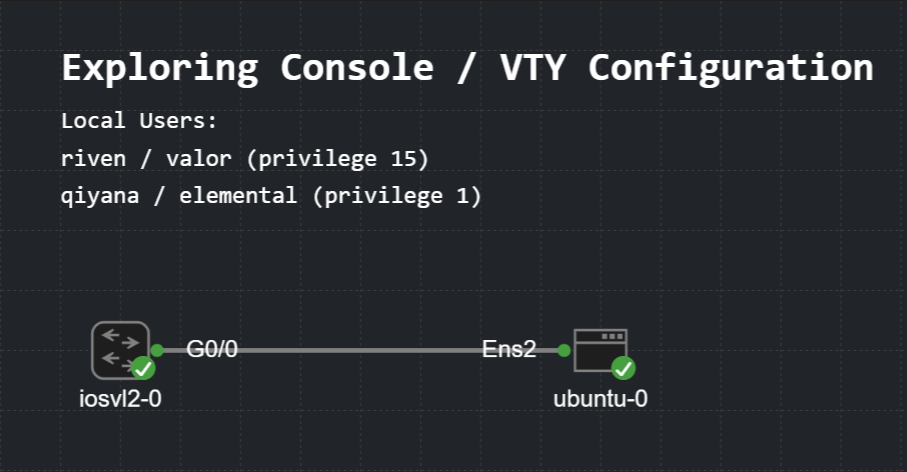

# Exploring Cisco Device Access: Console, VTY, SSH & Local Users



## 1. Prerequisites

SSH key generation requires both hostname and domain name

```
(config)# hostname Bluebird
(config)# ip domain-name phantomx.local
```
## 2. Local User Accoounts

Local users let you authenticate per-account instead of sharing a single line password. 

```
(config)# username riven privilege 15 secret valor
(config)# username qiyana privilege 1 secret elemental
```
| Field | Meaning |
| ----- | ------- |
| `privilege 1` | Read-only mode for basic tasks like checking connectivity or viewing interface statuses. Cannot alter configurations. |
| `privilege 2 - 14` | Customizable |
| `privilege 15` |  Complete read-and-write administrative access |

# 3. Console Line 

The console is the physical management port.

```
(config)# line console 0
(config-line)# login local

(config-line)# logging synchronous
(config-line)# exec-timeout 5 0
```
| Command | Purpose |
| ------- | ------- |
| login local | Authenticate against username / secret entries |
| exec-timeout 5 0 | Auto-logout after 5 minutes idle |
| logging synchronous | Stops log messages from scrambling what you type |

# 4. VTY Lines 

VTY (Virtual TeleType) lines are the virtual terminals used for remote access (Telnet/SSH). 

```
(config)# line vty 0 4
(config-line)# login local
(config-line)# transport input ssh
(config-line)# exec-timeout 10 0
(config-line)# exit
```

Disable the rest to migitate potential back door

```
(config)# line vty 5 15
(config-line)# transport input none
(config-line)# exit
```

| Setting | Effect |
| ------- | ------ |
| transport input ssh | SSH only (highly recommended) |
| transport input telnet | Telnet only (insecure) |
| transport input ssh telnet | Both |
| transport input none | No remote access on these lnes |

# 5. SSH Configuration

```
(config)# crypto key generate rsa modulus 2048
```

Force SSH Version 2.0 and Harden

```
(config)# ip ssh version 2
(config)# ip ssh time-out 60
(config)# ip ssh authentication-retries 3
```


