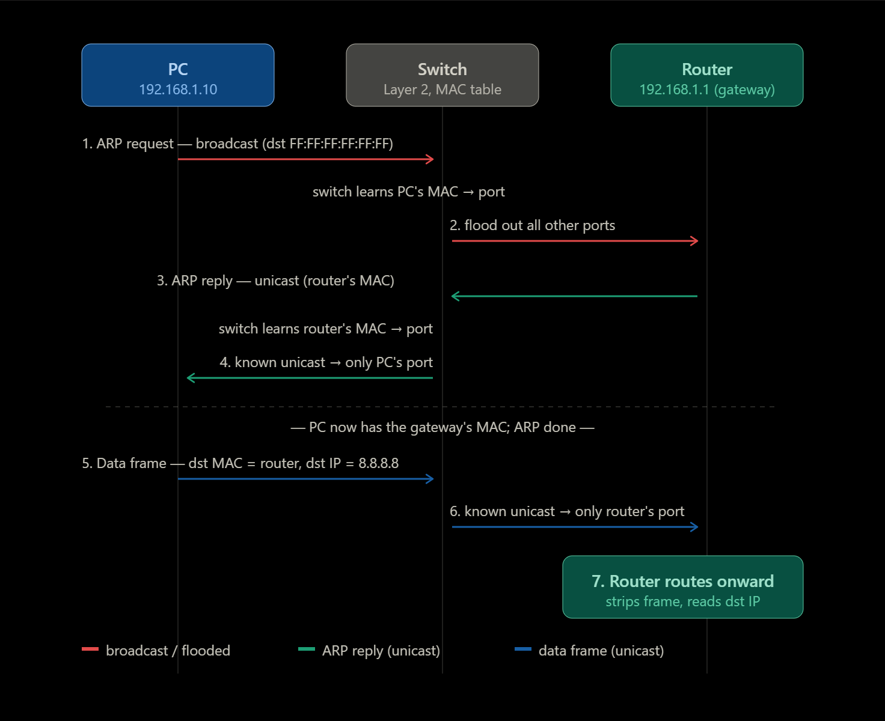

# Analyzing Ethernet LAN Switching

## The setup

Say your PC wants to reach a server out on the internet (8.8.8.8):

- PC → IP 192.168.1.10, MAC aaaa.aaaa.aaaa
- Switch → Starts with an empty MAC table
- Router (the default gateway) → IP 192.168.1.1, MAC bbbb.bbbb.bbbb

Because 8.8.8.8 is on a different network, the PC knows it must hand the packet to its **default gateway** first. But to build a frame to the router, it needs to know the router's MAC address.

To accomplish this the PC uses **ARP** broadcast frame to learn the router's MAC.

---

## Phase 1: ARP

The PC wants to reach 8.8.8.8. It compares that against its own subnet and realizes it's a **different network**, so the packet must go to the **default gateway** (the router at 192.168.1.1). To build a frame to the router, the PC needs the router's MAC address:

1. **PC broadcasts an ARP request:** "Who has 192.168.1.1?" Destination MAC is `FF:FF:FF:FF:FF:FF` (broadcast).
2. **The switch floods it:** The switch first learns the PC's MAC (from the source field) and records which port it's on. Then, because the frame is a broadcast, it sends it out every other port.
3. **The router replies with an ARP reply:** a unicast addressed straight back to the PC's MAC, containing the router's own MAC.
4. **The switch forwards the reply as a known unicast:** It already learned the PC's MAC in step 2, so it sends the reply out only the PC's port (no flooding needed). The switch also learns the router's MAC along the way.

After this phase, the PC caches the gateway's MAC in its ARP table and won't need to ARP again for a while.

## Phase 2: Actual Data

5. **PC builds the real frame:**
    - **Destination MAC** = the router's MAC `bbbb.bbbb.bbbb` (the next hop, Layer 2)
    - **Destination IP** = `8.8.8.8` (the final destination, Layer 3 unchanged)
6. **The switch forwards it as a known unicast** out only the router's port, since it now knows where the router's MAC lives.
7. **The router takes over routing.** It strips the Layer 2 frame, looks at the destination IP, and forwards the packet toward 8.8.8.8 and possibly running its own ARP on the next link to find the next hop's MAC.

## Unknown Unicast Flood???

In the example scenario, unknown unicast flooding never occurs because **ARP exchange taught the switch both MACs.**

- In step 2, when the switch flooded the ARP broadcast, it read the source field and learned the **PC's MAC + port**.

- In step 3, when the router's ARP reply came back, the switch read its source field and learned the **router's MAC + port**.

So by the time any unicast frame needed forwarding, the switch already knew where both devices lived. The ARP broadcast did double duty, **it resolved the IP→MAC for the PC and populated the switch's MAC table as a side effect.**

### So when does unknown unicast flooding actually occur?

When the switch receives a unicast frame whose destination MAC is not in its MAC table. The catch is that the **PC's ARP cache** and the **switch's MAC table** are completely independent and **age out on their own separate timers.** This mismatch is what trigger the switch to flood unknown unicast.

#### Picture this
 The PC and router have been quiet for a while:

1. The switch's MAC table entry for the router ages out (300s passed).
2. But the PC's ARP cache still holds the router's MAC (its timer hasn't expired).
3. The PC now wants to send data → it skips ARP (it already has the MAC) and sends a unicast frame straight to the router's MAC.
4. The switch looks up that destination MAC... not in the table → unknown unicast → flood out all ports.
5. The router receives it and replies; the switch re-learns the router's port, and the next frame is a known unicast again.

Unknown unicast shows up mainly after idle periods (table aged out) or with asymmetric traffic where the switch only ever hears one side.

## Frame Forwarding Comparison 

| Frame type | Destination MAC in the frame | How it reaches devices |
| --- | --- | --- |
| Known unicast | The specific target MAC (in the switch's MAC table) | Forwarded out the single matching port; only the target device receives it|
| Unknown unicast | The specific target MAC (unchanged, not in the table) | Flooded out all ports; only the match accepts, others discard |
| Broadcast | FF:FF:FF:FF:FF:FF | Flooded out all ports; all devices accept |

